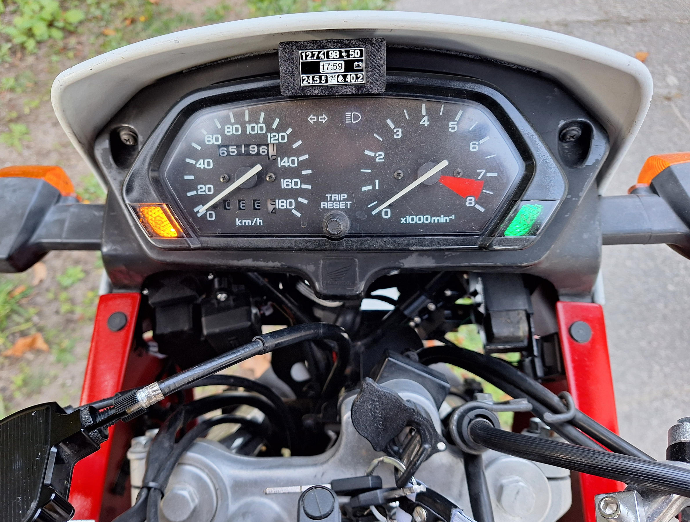
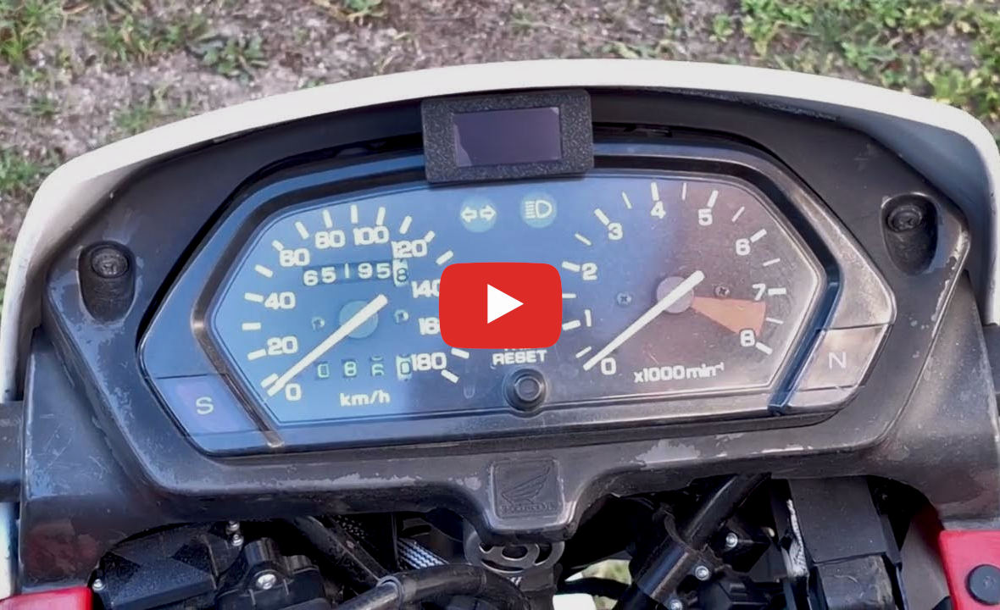
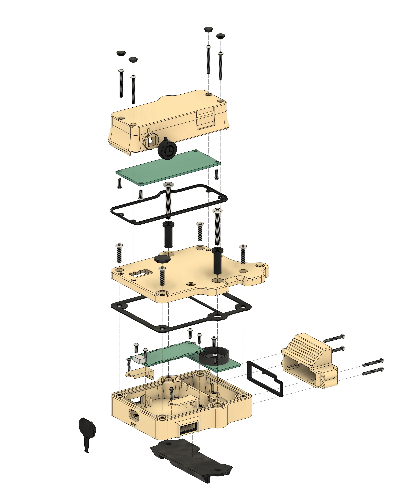
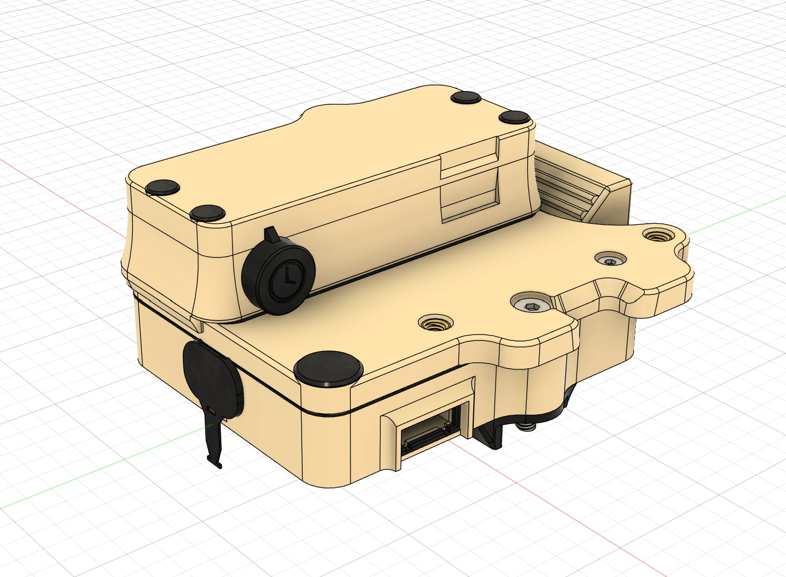
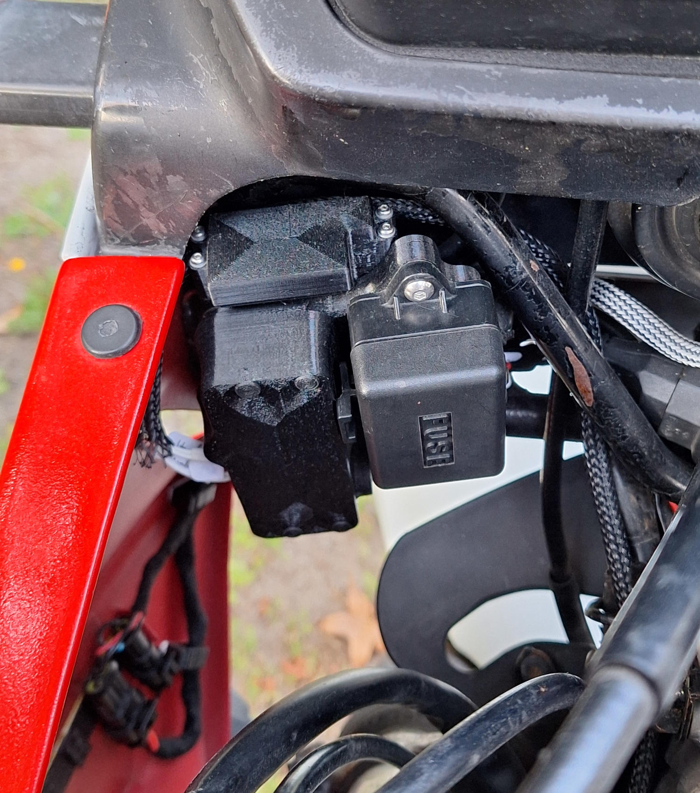
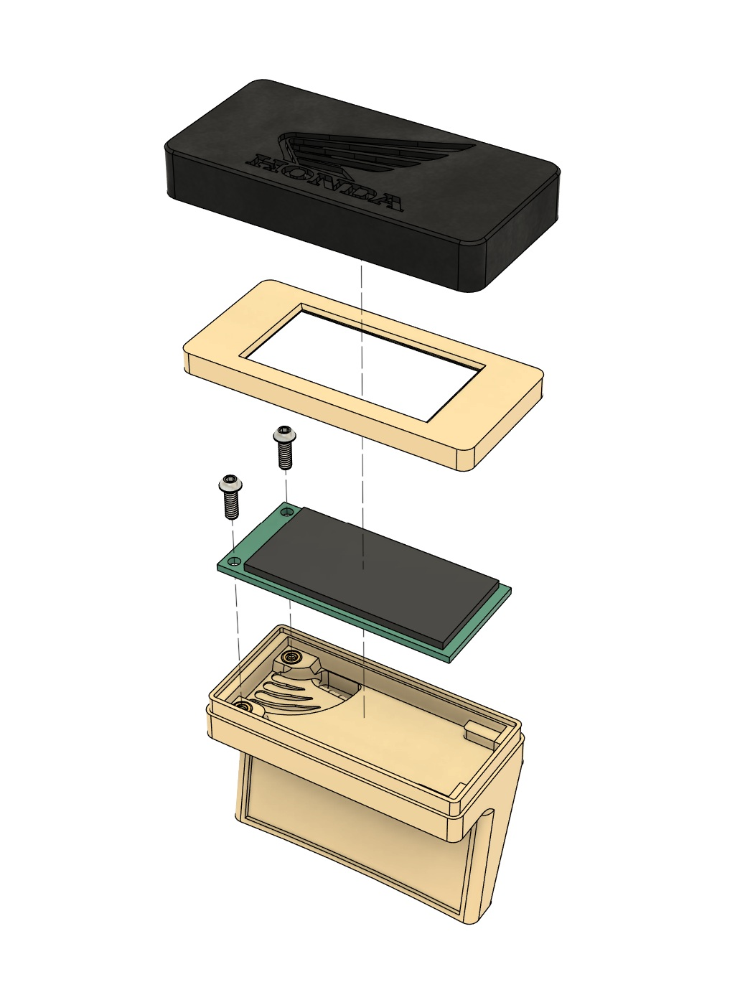
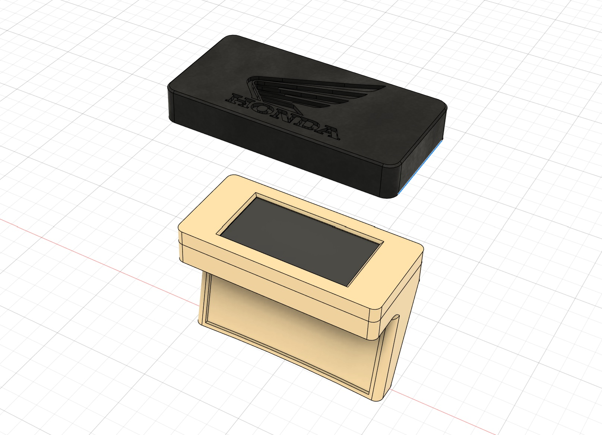
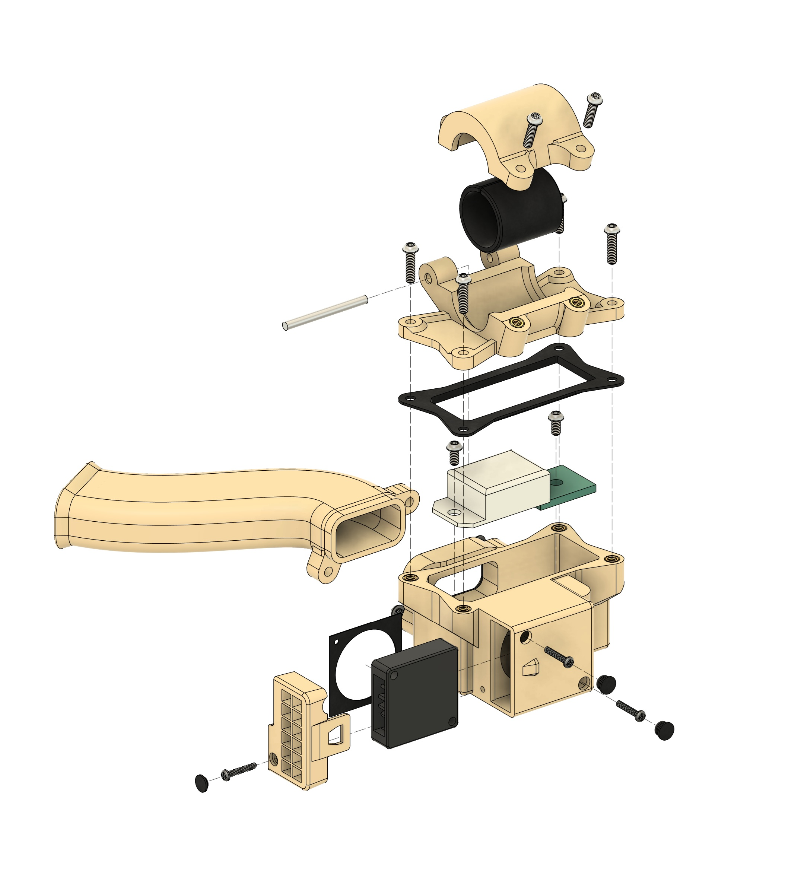
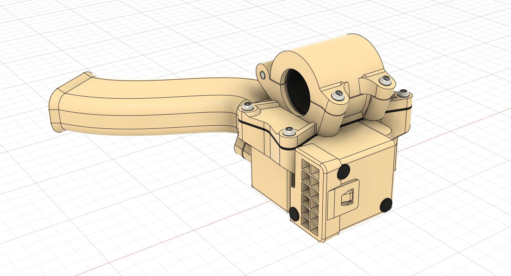

# Honda NX650 RD08 Dashboard

 

***This is a short summary of my Honda NX650 dashboard project.***

 

The source code is available [**here**](code/MMS-source/MMS-source.ino).

 

## Overview

The device displays the following:

- Engine Head Temperature;
- Engine Sump Temperature;
- Battery Voltage;
- Threshold warnings;
- Time;
- Air Temperature;
- Air Relative Humidity.

 

 

## Main Components
- [Main Box Assembly](#main-box-assembly)
- [Display Box Assembly](#display-box-assembly)
- [Air Monitoring Box Assembly](#air-monitoring-box-assembly)

 

## Main Box Assembly

The main box houses most of the electronics, including:

- Microcontroller (Raspberry Pi Pico);
- Precision Clock Module (DS3231);
- ADC Custom Board: mainly voltage dividers for the thermistors and voltage monitoring, along with signal filtering;
- Power Supply Unit: mainly a buck converter module, extra filtering, and a MOSFET to power the device when the ignition is turned on;
- Button for time adjustment.

 

    

This assembly bolts to the motorcycle's fuse box mounting bracket. 

I designed a pad to be placed between the bracket and the assembly to reduce vibration. There's also a sleeve around the mounting bolts for the same purpose. 

The motorcycle's fuse box is then bolted on top of the assembly.

    

 

## Display Box Assembly

This enclosure houses the OLED display module.

    

 

## Air Monitoring Box Assembly

This enclosure houses the DHT22 air temperature and humidity module, as well as a small blower fan. The fan creates negative pressure inside the enclosure to promote air circulation. This, in addition to the snorkel, was designed in an effort to reduce the influence of hot air from the engine.

    

